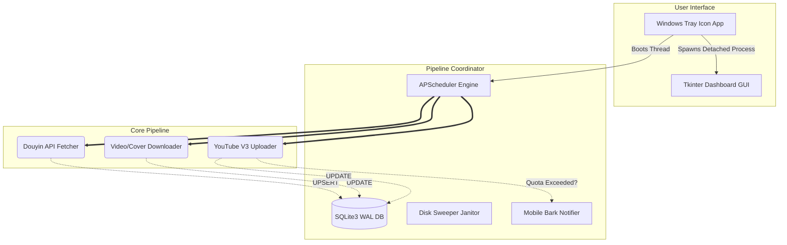

# DouyinSync 🚀 (抖音 -> YouTube 全自动搬运引擎)


**DouyinSync** 是一套具备“无人值守、防爆防封、智能熔断”的工业级自媒体数字分发护城河系统。它能够以静默的系统托盘形态常驻在您的 Windows 服务器/电脑上，24 小时全自动监视指定的抖音博主，并自动完成：**抓取 -> 查重过滤 -> 内存无感下载 -> WebP转码优化 -> 底层隧道穿透 -> YouTube V3 分块上传 -> iOS 实时推送报表** 的端到端全链路操作。

---

## ✨ 核心特性 / Core Features

- 🛡️ **无头守护与原子级容错 (Epic 1 & 4)**：采用子线程隔离与 `APScheduler` 定时轮询，永远不会卡死 UI主线程。如遇断电宕机，开机重启瞬间自动执行“僵尸件清算”回滚状态。
- ⚖️ **SQLite 幂等性状态机 (Epic 2)**：自带本地 `.db` (启用 WAL 高并发模型)，利用视频的 `douyin_id` 构建绝对的“防重复发送”与“进度锁”，支持多端并发现场保护。
- ⚡ **内存友好型传输极客 (Epic 2 & 3)**：哪怕处理长达 1 小时的 2GB 巨型 MP4 文件，下载/上传双端均采用超小 Chunk 进行 `Stream / MediaFileUpload` 切片循环，内存占用永远不超过极低阈值。
- 🌐 **精准的隧道切割代理 (Epic 3)**：直击最痛点——由于境内服务器需要特定翻墙才能连接 YouTube，系统利用 `httplib2.ProxyInfo` 强行将 Google Auth 客户端的底层 Socket 桥接进您的本地代理，实现国内网络直连抓取，海外接口穿透送达的无缝分离！
- 👁️ **Tkinter 并行仪表盘 (Epic 5)**：托盘内集成了可视化大盘弹窗 (Dashboard)。为防止原生线程崩溃，采用了独立的 `Subprocess` 对立子进程结构，查重数据、失败日志一目了然。

---

## 🏗️ 架构概览 / Architecture



---

## 📦 目录结构 / Structure

运行时 **`config.json`**、**`douyinsync.db`**、**`logs/`**、**`downloads/`** 等路径由 **`utils.paths.data_root()`** 解析：冻结 exe 默认为可执行文件所在目录；源码运行默认为仓库根；可通过环境变量 **`DOUYINSYNC_DATA_DIR`**（绝对路径、已存在目录）覆盖。

```text
仓库根/
 ├─ main.py                 # 入口：守护线程 + 托盘；子命令见下文
 ├─ requirements.txt · requirements-dev.txt · pytest.ini · config.example.json
 ├─ modules/                # 管道、抓取、下载、上传、DB、设置看板等
 ├─ ui/                     # tray_icon（当前主程序托盘）、dashboard_app（HUD）
 ├─ utils/                  # paths、models、decorators、logger…
 ├─ tests/                  # pytest
 ├─ docs/                   # 工程文档索引见 docs/index.md
 ├─ documents/              # 规范入口，链到 docs/
 ├─ _bmad/                  # BMM 配置 _bmad/bmm/config.yaml
 ├─ _bmad-output/           # BMAD 规划与冲刺产出
 ├─ build.bat · scripts/build_douyinsync.ps1 · DouyinSync.spec   # Windows 打包
 └─ dist/DouyinSync/        # 构建产物：DouyinSync.exe + 依赖（侧车配置放同目录或 DOUYINSYNC_DATA_DIR）
```

---

## ⚙️ 快速上手 / Quick Start

### 1. 环境安装
目前要求 `Python 3.10+`（推荐 3.11）。CI 在 Windows 上验证 **3.10–3.13**。打开终端执行：
```bash
pip install -r requirements.txt
```

### 2. 初始化核心凭证
在项目根（或 `data_root()`）准备**私密**文件：

*   **`client_secret.json`**：Google Cloud 启用 **YouTube Data API v3** 后下载的 OAuth 客户端 JSON。
*   **`config.json`**：运行参数。**推荐**复制仓库 **`config.example.json`** → `config.json`，再填入抖音 Cookie、Bark Key、`douyin_accounts` 里的主页 URL 等。**勿提交**含真实密钥的 `config.json`（已在 `.gitignore`）；**`youtube_token.json`** 同理（授权后生成，已在 `.gitignore`）。

- **`sync_schedule_mode`**：`interval` 每隔 `sync_interval_minutes` 分钟跑一次主同步；`clock`（或 `cron` / `daily`）按 **`sync_clock_times`** 本地 `HH:MM` 列表跑；未配列表时可退化为 **`cron_hour` + `cron_minute`** 单槽。**「搬运时间设置看板」**（`main.py settings`）在间隔模式下按 **小时** 填写，保存时写入 **`sync_interval_minutes = 小时 × 60`**。
- **`douyin_fetch_timeout_seconds`**：抖音作品列表 HTTP 超时（秒），默认 `15`。主进程每轮用 `asyncio.run()` 会换事件循环，抓取器内**每次请求新建** `httpx.AsyncClient`，勿复用旧版里长连接跨轮次的假设。

- **`youtube_client_secret_file`**：GCP 控制台下载的 OAuth 客户端 JSON 路径（默认 `client_secret.json`）。与 **`youtube_token_file`**（默认 `youtube_token.json`）、**`youtube_api_token`** 一起，由 `modules/scheduler.py` 传给上传器：日常上传用令牌文件或配置里的 token；**首次浏览器授权**或缺少密钥文件时，会读取该 JSON。

### 3. 一键启动
在拥有完整运行环境的命令行下执行：
```bash
python main.py
```
> **首次运行重点提示**：
> 系统探测到你的 YouTube Token 为空时，会自动**强制弹出一个浏览器窗口**，要求你登录目标 YouTube 账号并授权挂载点。授权点一次即可，系统会自动将加密凭证生成到 **`data_root()`** 下的 **`youtube_token.json`**（与 exe 同目录或 `DOUYINSYNC_DATA_DIR`）长期使用（即便掉线也会尝试静默刷新）。

启动成功后，您的桌面右下角系统托盘内会出现一个带有 "D" 字母的小图标。
在图标上点击 **右键** 即可操作 **「🎥 视频状态管理库」**（默认打开 CustomTkinter 实时大盘），或安全关停软件。

- **`python main.py dashboard`**（或 `DouyinSync.exe dashboard`）：Epic 5 HUD（全局统计、YouTube 配额条、分账号卡片、最近失败只读列表）；盘内按钮可再打开经典 **视频库** 窗口。
- **`python main.py videolib`**：经典 Tk 表格（筛选状态、批量重置 Pending；**F5** 刷新，**双击 / Ctrl+C** 复制，**导出 CSV** 按当前筛选含完整错误摘要）。与 HUD 独立进程，互不阻塞托盘主进程。
- **`python main.py settings`**：**搬运时间设置看板**（间隔按小时 / 定点 `HH:MM` 逗号分隔）；保存写入 `config.json` 并创建 **`.reload_config_request`**，主进程约 1 秒内重载并重挂 APScheduler（无需再点 Reload，若主进程在跑）。
- **`python main.py stats`**：统计子窗口。
- **`python main.py bark_test`**：可选附带一条消息参数，测试 Bark 推送（不跑管道）。

### 下载失败 / 上传失败时，系统怎么处理？

处理逻辑在 **`modules/scheduler.py`**（定时同步与手动同步共用）。日志里请搜前缀 **`PipelineCoordinator:`**，可看到具体动作（例如 `→ status=failed retry=…`、`give_up`、`queued retry …/3 → pending`）。

Dashboard **「手动重新执行（忽略重试上限）」** 会写入 **`.manual_force_retry_request`**：主进程本轮会先执行 **`prepare_for_force_manual_retry`**（把已放弃/高重试的失败条恢复为 `pending` 或 `downloaded`），并在该轮内**不按 3 次封顶**写入 `give_up`（仍受每日上传配额、磁盘预检、YouTube 熔断等约束）。

| 情况 | 系统行为（摘要） |
|------|------------------|
| **下载失败**（CDN/网络等） | 前 2 次：改回 **`pending`** 并增加 `retry_count`，下周期重新拉流再下；第 3 次仍失败：**`give_up`**，并发 Bark（若已配置）。 |
| **下载成功、上传失败**（含空 Token、网络错误等非配额类） | 记 **`failed`** 且**保留本地 MP4**，`retry_count` 递增；后续周期走 **Phase 3-Pre**（`get_uploadable_videos`）自动重传，最多 3 次后 **`give_up`**。 |
| **YouTube 配额用尽** | 记录保持 **`downloaded`**，打开 24h 断路器，不计入「上传 3 次」重试。 |

更细的表与 BMAD 故事见：**[docs/architecture.md](docs/architecture.md)**（§4.3）与 **`_bmad-output/implementation-artifacts/stories/3-4-download-and-upload-failure-handling.md`**。

若日志曾出现 **`Illegal header value b'Bearer '`**，表示曾向 Google 发送了**空的 Bearer**。当前版本会在 **`youtube_api_token` 留空**时，自动尝试从运行目录下的 **`youtube_token.json`** 读取并刷新令牌（也可用 `config.json` 的 **`youtube_token_file`** 指定路径）。若仍失败：请完成一次 OAuth（见上文「首次运行重点提示」），或把有效访问令牌写入 **`youtube_api_token`**。

---

## 📋 文档与 BMAD

| 入口 | 说明 |
|------|------|
| [docs/index.md](docs/index.md) | 工程文档总索引（架构、数据模型、部署、源码树等） |
| [docs/bmad-documentation-alignment.md](docs/bmad-documentation-alignment.md) | BMAD `document-project` 流程与本仓库路径对齐 |
| [docs/deployment-guide.md](docs/deployment-guide.md) | PyInstaller 构建、`data_root`、侧车文件与哨兵文件 |
| [_bmad/bmm/config.yaml](_bmad/bmm/config.yaml) | BMM 路径变量 |
| [_bmad-output/planning-artifacts/](_bmad-output/planning-artifacts/) | PRD 快照、Epic/Story、追溯矩阵 |
| [_bmad-output/implementation-artifacts/sprint-status.yaml](_bmad-output/implementation-artifacts/sprint-status.yaml) | 冲刺状态 |

---

## 📝 二次开发提醒 
整个项目由极其松耦合且遵守单一职责原则的组件拼接。如需魔改某个节点（比如你想加个 TikTok 发布渠道）：
1. 在 `modules` 内撰写独立的 `tiktok_uploader.py`。
2. 在 `modules/database.py` 中扩充对应字段 `tiktok_status`。
3. 在 `modules/scheduler.py` 的轮询块中填入 Hook 即可完工。

*(此项目核心工业级逻辑产出归属于 BMad Agility 极限重构实验模型，仅供辅助研究自动化工具，请勿滥用于黑产)*
