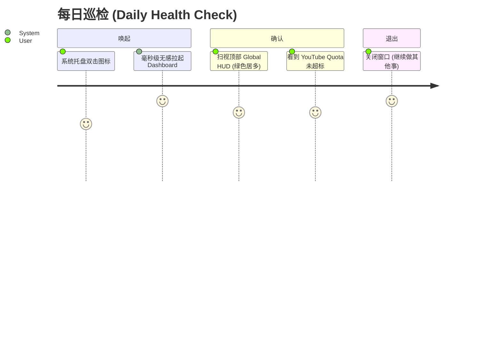
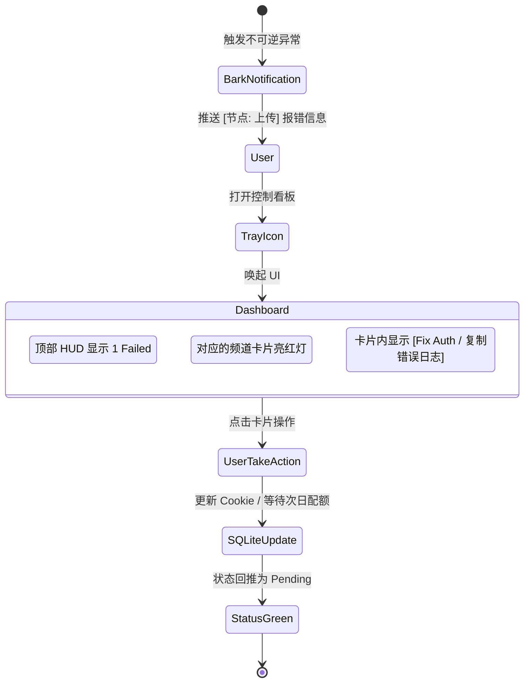

# UX Design Specification DouyinSync

**Author:** Administrator
**Date:** 2026-04-21

---

## Executive Summary

### Project Vision

DouyinSync 的体验愿景是提供“无痛且极具安全感”的跨域同步监控手段。日常隐形运行，仅在托盘中存驻；当用户主动唤起时，以一张数据可视化面板（Dashboard）将错综复杂的搬运成功率、积压任务与状态分布直观地降维展现。

### Target Users

多平台内容创作者、搬运管理员。他们具备基础的技术素养（能编辑 JSON、抓取 Cookie），厌烦重复搬砖劳动，极度渴求系统能拥有自愈力，并通过 Dashboard 快速且精确掌控多账号下的流水线作业健康度。

### Key Design Challenges

1. **复杂状态的可视化聚合**：如何在不显得拥挤的情况下，清晰展现单账号在多达 5 种处理节点（从发现新视频到 YouTube 上传妥投）的数据堆积。
2. **异步控制反馈**：由于 UI 进程与后台守护 Daemon 严格分离，当用户在面板点击“手动运行”或托盘点击“重载”时，如何优雅地处理异步返回。
3. **异常聚焦**：从几百条正常的任务流中，剥离出那几个因为“Quota 限制”或“Cookie 过期”而 Failed/GiveUp 的卡片，引导用户去修复。

### Design Opportunities

1. **“流量仪表盘”极简直观法则**：采用现代科技感的卡片式数据网格与红/绿/黄信号灯颜色隐喻，打造无门槛的秒级监控系统。
2. **免干预的信赖感建设**：不用重度交互去修改规则，只需看进度即可。

## Core User Experience

### Defining Experience

DouyinSync 的核心体验是 **“状态的一瞥即知 (Glancability)”** 与 **“免打扰的信任感 (Zero-Interference Trust)”**。
用户最高频的核心动作不是“操作”，而是“验证”。因此，“一键查看监控看板”与“接收 Bark 推送”这两种被动行为，是产品的灵魂交互。最关键的任务是让用户能在 3 秒内判定当前系统的健康度或是哪个环节卡住了。

### Platform Strategy

*   **Host OS**: 原生 Windows 桌面环境（后台无头运行与系统托盘驻留）。
*   **Dashboard View**: 轻量级的本地 GUI (推荐使用 Tkinter 或精简的本地 Web UI)，绝不可阻断或干涉主程的异步/轮询。
*   **Mobile Extend**: 仅通过 Bark APP 接收推送，无需额外的移动端操作。

### Effortless Interactions

*   **一键触达**：右键点击托盘 -> 打开 Dashboard 显示实时聚合状态，无任何多余的加载条或过度动画。
*   **色彩隐喻**：通过信号灯隐喻 (绿色=Uploaded, 黄色=Pending/Processing, 红色=Failed/GiveUp) 取代长篇大论的表格。
*   **去主动化**：系统在后台抛出错误时（如 Cookie 过期），通过 Bark 极其明确地提供下一步修复建议，用户不需要自己去爬取日志分析。

### Critical Success Moments

1.  **“掌控感”的瞬间**：打开面板看到当日 100 张任务卡片干净利落地从 pending 流向 uploaded。
2.  **危机自愈的瞬间**：网络出现 403 熔断时，系统自动切入休眠并上报，用户无需强行拔电源重启；次日系统又优雅地自动恢复流转。
3.  **零延时响应**：当用户在托盘点击“重载配置”或“手动执行”时，托盘图标立刻给出轻量的反馈（如闪烁提示音），让用户感到系统是“活的”。

### Experience Principles

1.  **数据的降噪处理**：只展示用户真正关心的（剩余量、成功量、封锁状态），隐藏一切非致命的重试日志。
2.  **异步安全感**：所有的 UI 交互不能产生“阻塞感”，反馈可以晚到，但系统不能假死。
3.  **高容错包容性**：提供清晰指引（如：如何重新获取 Cookie），即便配置崩溃，也永远给用户一条安全的重启出路。

### Defining Experience Mechanics

#### The Defining Action: "The Reassurance Glance" 
DouyinSync 最核心的交互不是“操作”，而是“验证 (Reassurance)”。当用户在刷牙或者喝咖啡时，右击托盘唤出 Dashboard，扫一眼看到大面积的绿色（成功）和跳动的数字，随后关闭面板。这就完成了产品的核心价值交付。如果这个流程顺畅且能提供安全感，那么一切其他功能都在其基础之上自然成立。

#### User Mental Model

*   **当前痛点**：目前用户检查自动化脚本的死活，只能去翻看黑底白字的 `CMD` 屏幕或冗长的 `.log` 文件，体验极度反人类。
*   **心理预期**：用户将 DouyinSync 视为一个“黑盒工厂”。他们并不想关心里面是到底怎么并发、怎么限流的，他们只需确信“上游抖音塞了 10 个进去，下游 YouTube 吐了 10 个出来”。

#### Success Criteria

*   **极速响应 (Speed)**：要求 Dashboard 的唤起必须在 0.5 秒内，无视后台是否有几百兆的视频正在上传。绝对不能出现因 I/O 阻塞造成的窗口假死 (Not Responding)。
*   **无需阅读的图形语言 (Reading-free)**：所有的状态不需要通过文字来解读。绿色代表一切安好，黄/红色块如同停车场的报警灯，即使闭着半只眼睛也能看清系统健康度。

#### Novel vs. Established UX Patterns

*   **Established (沿用范式)**：Windows 系统托盘的右键菜单（Start, Stop, Exit, Dashboard）。符合所有 PC 用户的肌肉记忆。
*   **Novel Twist (微创新)**：将传统属于 DevOps 领域的“CI/CD 流水线节点监控（像 GitHub Action 那样）”降维应用于一个桌面工具面板上，用流转的观念替代静止的数据表。

#### Experience Mechanics Flow

1.  **Initiation (启动)**：用户双击或右击系统托盘的彩色动态图标。
2.  **Interaction (交互)**：面板瞬间弹出，自动执行（只读）数据库轮询，UI 上无任何阻塞型输入框。
3.  **Feedback (反馈)**：
    *   面板顶部实时展现一张横向进度条 / Pie Chart：`[总抓取 100] [处理中 5] [已上传 95]`。
    *   如果有视频处于 Failed，对应底部的卡片高亮红色并提供一个 `[Copy Log]` 或 `[Retry]` 按钮。
4.  **Completion (完成)**：用户得知系统正常，点击右上角 `X`，面板瞬间消失，系统回归深海潜游状态。

## Desired Emotional Response

### Primary Emotional Goals

*   **真正的解脱感 (Unburdened Release)**：让用户觉得“终于把这件痛苦的搬运苦差事甩脱了”。
*   **尽在掌控 (In Control)**：尽管是黑盒自动化，但通过节点反馈，用户不会觉得失去了对账号的管理权。
*   **绝对的信赖 (Absolute Trust)**：不管遇到什么极端情况（断网、限流），工具都不会搞砸，不用提心吊胆。

### Emotional Journey Mapping

*   **唤醒阶段 (Wake up)**：每次开机看到系统托盘的小图标，感到安心。
*   **核心运转阶段 (Ongoing)**：完全无感。甚至在收到 Bark 聚合通知：“今日已自动拉取 10 条，上传 10 条”时，产生一种不用工作也能有产出的“白嫖式愉悦”。
*   **主动监控阶段 (Dashboard)**：打开仪表盘，没有任何焦虑感。看到大量的绿色（成功）和少量的黄色（等待配额），觉得系统就像一个可靠的管家在按部就班地干活。
*   **异常宕机阶段 (Failure)**：当确实遇到账号 Cookie 被封锁时，不感到恐慌。系统不会强制弹窗打扰当前工作，而是静默变红并在手机上推送“诊断+指导意见”。

### Micro-Emotions

*   **Confidence vs. Confusion (确定感 vs. 迷茫)**：绝不让任务卡在未知的中间态；即便失败，也会明确告知是进入了“退避重试循环”，还是彻底的“放弃 (Give Up)”。
*   **Accomplishment vs. Obligation (成就感 vs. 负担)**：虽然用户没有手动搬运，但看着数字在 Dashboard 上跳动，自身有一种“掌控了一支数字员工大军”的成就感。

### Design Implications

*   **为“信赖”做减法**：如果一个错误（如短时网络拥堵）系统能自愈（通过 `@auto_retry`），那就**绝对不要**在 GUI 上或者 Bark 上告警。UI 只展示人类必须干预的致命错误。
*   **为“掌控”做加法**：在 Dashboard 上加入一个全局视角的“成功转化率”图形（Pie Chart 或漏斗），从视觉上强化“系统成功率极高”的潜意识。

### Emotional Design Principles

1.  **坏消息要具体，好消息要克制**：成功的通知可以打包成日报合并发送，但 Cookie 过期的坏消息必须单独、及时、明确地送达。
2.  **避免闪烁性恐慌**：数据刷新要平滑，使用柔和的过渡和静谧的色彩（避免高频的警告黄/危险红），保持产品一贯的“后台隐匿”特质。

## UX Pattern Analysis & Inspiration

### Inspiring Products Analysis

为了打磨极简的 Dashboard 与系统托盘体验，我们从以下备受开发者与专业用户喜爱的产品中汲取灵感：

1.  **Docker Desktop (容器面板)**：以极简的列表和绿/灰圆点表示容器的存活状态，配合单点操作（Start/Stop/Logs）。
2.  **Vercel / GitHub Actions (流水线面板)**：对于持续集成状态的卡片化展示（Queued -> Building -> Deployed），非常契合我们视频的流水线流转（Pending -> Processing -> Uploaded）。
3.  **OneDrive / Dropbox (系统托盘体验)**：常驻系统，仅在同步（Syncing）和错误时出现明显的图标变化，绝不主动占领桌面视线。

### Transferable UX Patterns

*   **Status Indicators (状态指示器)**：采用极简的几何图形与颜色组合（如闪烁的绿点代表 Processing，静止的绿点代表 Uploaded）替代冗长的文字描述。
*   **Single-Page Tabbed Layout (单页标签布局)**：如果管理多个账号，通过顶部的平级 Tab 切换不同的 Douyin Account，而不是通过深层级的跳转，确保信息扁平。
*   **Logarithmic Roll-ups (折叠日志)**：将底层报错折叠在卡片或 "Details" 按钮之后，默认只显示 "Failed: Cookie Expired"。

### Anti-Patterns to Avoid

*   **GUI 进度条灾难 (Progress Bar Spam)**：不要在 UI 中高频渲染 0%~100% 的精准下载进度条。过度的 UI 重绘会拖垮主线程性能。只需要展示状态跃迁（如 downloading -> downloaded）。
*   **暴露原始错误堆栈 (Naked Stacktraces)**：UI 上绝不能直接 Dump 满屏幕的代码报错，这会引起普通用户的视觉恐慌。
*   **试图在 MVP 中做复杂的 JSON 表单配置**：与其做一个难用的 UI 表单来配置网络代理和 Cookie，不如维持直接修改 `config.json`，然后给出一个优雅的 `Reload Config`（重载配置）按钮。

### Design Inspiration Strategy

**What to Adopt (采纳):**
借鉴 Vercel 的卡片式流转视图，用极简的块状展示 Videos 的状态；系统托盘行为严格对齐 OneDrive，追求静默。

**What to Avoid (避免):**
避免任何阻塞主线程的复杂渲染；避免使用原生的大体积全屏窗口，Dashboard 应像轻弹窗一样极速启停。

## Design System Foundation

### 1.1 Design System Choice

**推荐选择：CustomTkinter (Modern Native Python UI)**
放弃传统的 Tkinter 丑陋风格，也放弃重量级的 WebView/Electron 或本地 Web Server (FastAPI + React)。我们将专注于使用 Python 的 `CustomTkinter` 库来构建 Dashboard。

### Rationale for Selection

1.  **极简的内存占用 (RAM Constraints)**：PRD 要求 (NFR1) 空闲时内存必须 <100MB。启动一个本地 Web API 和浏览器实例来展示几个图表是一种“高射炮打蚊子”的浪费，而 CustomTkinter 可以直接与 SQLite 共享同一个 Python 进程内存。
2.  **视觉契合度 (Visual Fit)**：CustomTkinter 原生自带极其优雅的 Dark Mode（暗黑模式），非常符合 DouyinSync 作为一个“静默后台管道引擎”的赛博朋克极客气质。
3.  **零外部依赖 (Zero External Dependencies)**：不需要用户再去安装 Node.js，直接被 PyInstaller 打包进唯一的 `.exe` 文件中，开箱即用。

### Implementation Approach

*   **进程解耦隔离**：由于 Python 的 GIL（全局解释器锁），CustomTkinter 的 `mainloop()` 将在主线程启动，而爬虫和下载的 `PipelineCoordinator` 将被推进 `threading.Thread(daemon=True)` 中。
*   **单向轮询数据流 (Read-only Polling)**：Dashboard 每隔 3 秒执行一次 `SELECT COUNT(*)` 查询 SQLite 并刷新卡片数字，绝对不接触业务流转代码，避免导致数据库死锁 (Lock timeout)。

### Customization Strategy

*   **Color Palette (流量监控体系)**：
    *   **Background**: 深邃灰 `#1E1E1E` (Dark Mode Default) 或 `#2B2B2B`。
    *   **Success Component**: 森林绿 `#2ECC71` (用于表示 Uploaded)。
    *   **Warning Component**: 警示黄 `#F1C40F` (用于表示 Pending / Quota Blocking)。
    *   **Error Component**: 鲜艳红 `#E74C3C` (用于表示 Failed / Give_Up)。
*   **Typography (排版)**：直接调用 Windows 原生的等宽字体（如 Consolas / Segoe UI），突出硬核的数据监控感，放弃花哨的衬线字体。
    *   H1/总计数字: 48px / Bold
    *   H2/频道大标题: 18px / Semi-Bold。
    *   Body/基础日志: 13px / Regular。

### Spacing & Layout Foundation

采用 **“紧凑但有序 (Dense but Ordered)”** 的 8px/4px 基准网格：

*   **卡片间距 (Card Gaps)**: 8px (允许在有限的弹窗屏幕内容纳多个频道的卡片)。
*   **内部留白 (Paddings)**: 面板外边距 16px，卡片内边距 12px。
*   **对齐原则 (Alignment)**: 所有状态指示灯在最左侧垂直对齐，所有操作按钮 (Retry/Logs) 在最右侧垂直对齐，数字和图表居中。

### Accessibility Considerations

*   **对比度 (Contrast Ratio)**：背景与主文本 (`#1E1E1E` vs `#E5E7EB`) 对比度大于 7:1，完全符合 WCAG AAA 标准。
*   **色弱友好 (Color-Blind Friendly)**：除了红黄绿色块，必须配合 Icon（例如绿色旁边加 `√`，红色旁边加 `×`，黄色旁边加 `↻`）辅助状态传达，不纯粹依赖颜色作为唯一信息源。

## Design Direction Decision

### Design Directions Explored

通过 HTML Prototype，我们探索了三种不同复杂度的布局体系：
1. **Direction 1: Vercel / CI-CD Style**: 重视单账号的进度条，展示账号维度的管道堆积情况。
2. **Direction 2: Docker Desktop Style**: 极简的行级 (Row-level) 列表，仅用色点标识状态，适合单页展示极大数量的账号。
3. **Direction 3: Mini Global HUD**: 不展示账号维度，仅用大字号展示“今天全局处理了多少”（Pending vs Uploaded），以及当前 YouTube API 容量 (Quota) 的健康度。

### Chosen Direction

**选定方向：Hybrid Direction (顶部 Global HUD + 下方 CI-CD 账号流转卡片)**

我们不采取单一走向，而是融合 Direction 3 与 1，打造两层信息的渐进收起：
*   **首屏顶部 (Top Section)**：固定高度的 Global HUD，展示全部账号加起来的总处理量与总成功量，以及 YouTube 每日限额（10,000 Quota）的消耗进度条。
*   **主要内容区 (Scrollable Main Area)**：采用 Vercel 风格的垂直卡片列表，每一张卡片代表一个 Douyin 爬取目标源，展示单独的 `uploaded / pending` 状态。

### Design Rationale

之所以融合 HUD 与卡片，是因为“免打扰”诉求：
绝大部分时间系统没有错误，用户右键打开 Dashboard，只瞥见最上方 Global HUD 中巨大的绿色数字和安全的 Quota 进度条，就会放心关掉窗口（实现 0.5秒体验）。
而当 HUD 中出现红色 Failed 数字时，用户才会向下滚动查找具体是哪一张 Vercel 卡片爆红，并对其进行 `[Retry]` 操作。这种**从宏观到微观**的信息分层，极大地降低了认知负荷。

### Implementation Approach

1. 在 `CustomTkinter` 中，使用 `CTkFrame` 创建两个横向分隔的区块。
2. 在 Upper Frame 中，用 3 个并列的大字体 `CTkLabel`（绿色/黄色/红色）渲染 Global Stats。
3. 在 Lower Frame 中，植入一可滚动的 `CTkScrollableFrame`，通过遍历 `config.json` 中的账号，为每个账号生成一张包裹各种组件的卡片式 `Frame`。

## User Journey Flows

### Journey 1: The Daily Health Check (无痛巡检)

这是最最高频的场景，代表了“Zero-Interference Trust (零干扰信赖)”的核心价值。用户仅仅是为了获得“一切都在掌控中”的安全感。

**体验洞察 (Experience Insight)**:
*   **无选择即效率**：这个流程里没有任何多余的按钮要点。为了达到这个流畅度，Dashboard 的拉起必须是只读且异步的。
*   **情绪终点**：极大的安心感。

### Journey 2: Error Recovery (危机接管与自愈)

当系统遇到超过 `@auto_retry` 容忍度的故障（如：账号 Cookie 完全过期，或 YouTube 403 限流）时，系统进行被动打扰并引导用户收服危机的流转。

**体验洞察 (Experience Insight)**:
*   **剥洋葱式的异常聚焦**：Dashboard 既呈现了总体的 Failed 数量，又精准高亮了是底部的哪一张卡片卡住了。用户不需要去几千行的文本日志里人肉 `Ctrl+F` 搜 Exception。
*   **情绪终点**：从瞬间的警觉（Notification），到明确的行动路径（Dashboard），最后化解危机，形成闭环掌控感。

### Journey Patterns

通过以上两条链路，我们在交互设计上提取出以下可复用的范式：

*   **The "Glance and Go" Pattern (看一眼就走)**：默认所有界面呈现处于只读、收起的宏观状态。没有阻拦弹窗，没有强制前置加载条。
*   **Actionable Errors (可操作的异常)**：绝不向用户呈现一段生硬的堆栈代码 (Stack Trace)。如果是网络熔断，按钮显示 `[Ignore]`；如果是 Cookie过期，按钮直接引导为 `[Fix Auth]`。

### Flow Optimization Principles

1.  **极速的 First Paint (首屏渲染)**：不管 SQLite 里积压了多少任务记录，Dashboard 必须能在 `0.5s` 内完成组装与渲染。
2.  **优雅降级 (Graceful Degradation)**：如果渲染具体账号记录遇到了卡顿甚至数据库锁，那至少要把顶部的 Global HUD 渲染出来让用户看到。

## Component Strategy

### Design System Components (CustomTkinter 基建)

基于选定的 `CustomTkinter` 框架，我们能够免开发直接调用的**基础组件**有：
*   **CTkFrame**: 用于所有界面的基础承载和卡片背景。
*   **CTkScrollableFrame**: 用于实现纵向滚动的账号流水线卡片列表。
*   **CTkLabel**: 用于所有的文本（用户名、数值、日志输出），原生支持颜色配置。
*   **CTkButton**: 用于底部的操作动作（如 `[Fix Auth]`）。
*   **CTkProgressBar**: 可以直接充当 YouTube 每日 Quota 容量的视觉化横条。

### Custom Components (核心定制组件)

通过分析上面的“无视干扰”用户旅程，我们需要使用基础组件定制组合出 2 个核心的高级业务组件：

#### 1. Global-HUD-Panel (全局宏观监控板)
*   **Purpose**: 将最核心的“大盘健康度”推到第一视觉层级，让用户一眼安心。
*   **Anatomy**: 
    *   上方横向分为 3 个等距块：巨大的数字 (Large Font `CTkLabel`) + 底部副标题。
    *   下方铺设一根贯穿的 YouTube 容量配额 (`CTkProgressBar`)。
*   **States**: 
    *   **Healthy**: Quota < 80% (进度条为绿色)。
    *   **Warning**: Quota > 80% (进度条变黄)。
    *   **Exhausted**: Quota = 100% (进度条变红，并在全局抛出警告)。

#### 2. Pipeline-Status-Card (账号流水线卡片)
*   **Purpose**: 当发生错误时，让用户可以在长列表中迅速定位具体是哪个号的凭证失效了。
*   **Anatomy**: 一个深灰色的包裹容器 (`CTkFrame`)，左边是账号 `@ID` 和 报错原因；右边是一个圆点 (`Status Dot`) 以及比例数字 `X / N`。
*   **States**:
    *   **Normal**: 只有白灰文字和绿点，卡片边框隐藏。
    *   **Error Active**: 整个卡片出现红色边框 `#E74C3C`，内部显示一个明显的 `[Fix Auth/Retry]` 按钮。

### Component Implementation Strategy

在 `CustomTkinter` 的实现上，采用**“数据驱动渲染 (Data-Driven Make)”**模式：
1. UI 渲染主进程与 `douyinsync` 的守护进程完全隔离。
2. 组件的组装全部采用 Object-Oriented (面向对象) 写法，比如创建一个 `class PipelineStatusCard(CTkFrame):`。
3. 界面通过一个 3 秒一次的 `after()` 定时器查询 SQLite，拿到类似 `{'LiZiqi': 'error', 'TechReview': 'done'}` 的字典，然后**批量更新 (Update)** 这些子组件实例内部的 Label，而不是每一帧都去销毁重建卡片。

### Implementation Roadmap (落地路线图)

*   **Phase 1 - Frame & Data Binding (基建)**: 创建主窗口和 `CTkScrollableFrame`，打通 Dashboard 异步只读查库的链路，防止 UI 阻塞。
*   **Phase 2 - Global HUD (全局视口)**: 实装大字号的全局数据展示以及 Quota 进度条。达成 80% 时间不用滚动查阅的目标。
*   **Phase 3 - Reactive Status Cards (卡片状态与动作)**: 绘制 `PipelineStatusCard`，并只针对呈现 Failed 状态的卡片渲染 `[重试]` 或 `[修改配置]` 的动作按钮。

## UX Consistency Patterns

### Button Hierarchy (按钮层级与动作模式)

由于 Dashboard 以监控为主，对用户的交互输入非常克制，我们将按钮分为严格的三个层级：

*   **Primary Action (主动作)**：
    *   **外观**: `CTkButton`，实心填充，颜色视语境而定 (例如蓝色的 `[Reload Config]` 或红色的 `[Retry Failed]`)。
    *   **适用场景**: 当前视图下用户唯一需要关心的核心化解动作。
*   **Secondary Action (次级动作)**：
    *   **外观**: `CTkButton` (Transparent/Outline)，边框高亮但背景透明，文字变灰。
    *   **适用场景**: `[Copy Logs]`, `[View Detail]` 等辅助性动作。
*   **Destructive Action (危险动作)**：
    *   **外观**: 只有在鼠标 Hover 时才会高亮为刺眼的 `#E74C3C` 红色，平时显示为灰色。
    *   **适用场景**: `[Stop Pipeline]`, `[Force Kill]` 等中断自动化的操作。必须配合物理弹窗或长按确认。

### Feedback Patterns (状态反馈范式)

我们处理了多端同步的反馈节奏，绝不造成“信息轰炸”：

*   **静默流转 (Silent Sub-states)**：例如视频从 `downloading` -> `processing` -> `ready_to_upload`。这些底层跃迁在面板上一律收敛为黄色的 `[Processing]` 状态，**不在 UI 上做高频的文字刷新**，避免屏幕闪烁。
*   **物理震感反馈 (Bark Push)**：
    *   **Success**: 每日只发一次汇总通知 (Daily Summary)。
    *   **Error**: 发生阻断型错误 (如 Cookie 失效) 必须**即时推送**并带上具体账号名。
*   **托盘交互反馈 (Tray Interaction)**：右键点击托盘中的操作（如 Reload），系统必须在 0.5s 内通过原生的 Windows Notification System (Toast) 弹出一条轻量提示 `"Config Reloaded"`。

### Empty / Disconnected States (空状态与断连模式)

*   **No Config (首次运行空配置)**：如果检测到没有 `config.json`，整个主界面的卡片列表消失，取而代之的是中间一个巨大的插画/居中文字提示：“请配置 config.json 并点击 [Reload]”。
*   **Database Locked (数据库阻塞)**：如果 UI 在向 SQLite 轮询时遭遇 `database is locked`，UI **绝对不能崩溃闪退**。此时顶部的 Global HUD 数字全部显示为 `---` 并在旁边显示黄色的 `[Syncing...]`字样，UI 进程必须默默等待下一次 3 秒轮询。

### Window Control Patterns (窗口控制范式)

*   **Loss of Focus (失焦即藏)**：作为一款背景辅助工具，只要用户点击了桌面的其他地方让这个面板失去了焦点 (FocusOut Event)，**面板自动隐藏**，回到系统托盘，而不是像常规软件一样永远霸占在任务栏里碍眼。
*   **Single Instance (单例模式)**：反复双击托盘，不允许弹出多个 Dashboard 窗口。只能是将已经弹出的唯一窗口提起 (Bring to Front)。

## Responsive Design & Accessibility

### Responsive Strategy (窗口适配策略)

不同于 Web 应用，DouyinSync 的 Dashboard 本质上是一个悬浮的“微组件面板 (Widget Panel)”。

*   **Fixed Width, Flexible Height (定宽动高)**：为了保持“一瞥即知”的紧凑感，窗口的物理宽度锁定为 `400px` 或 `450px`（不允许用户横向拉伸破坏排版）。窗口的初始高度设为 `600px`，如果总配置的账号过多（超过 6 个），启用内部的竖向滚动条 `CTkScrollableFrame`。
*   **Sticky to Corner (智能边缘吸附)**：由于是从托盘唤起，窗口应计算当前鼠标所在的系统托盘位置（通常在屏幕右下角），并自动将窗口吸附在右下角安全区域显示，避免遮挡屏幕中央的活动窗口。

### High-DPI & Breakpoint Strategy (高屏幕分辨率缩放)

在现代 Windows 生态中，最致命的排版问题是“缩放比例失调”。

*   **DPI Awareness (高分屏感知)**：必须调用 Windows 原生 API (如 `ctypes.windll.shcore.SetProcessDpiAwareness(1)`) 确保窗口在 4K 屏幕上（比如 150% 或 200% 设置下）不会模糊发虚。
*   **Scale Binding**：调用 `CustomTkinter.set_widget_scaling()` 绑定系统当前的显示比例，确保字体大小（如 48px 的监控总数）在所有显示器上都保持绝对的视觉冲击力。

### Accessibility Strategy (无障碍策略)

我们将对齐基础的桌面 UI 无障碍标准 (WCAG AA 等效)：

*   **完全的键盘遍历 (Full Keyboard Navigation)**：
    *   打开窗口后，按 `Tab` 键可以顺次在不同的 Channel Cards 的 `[Retry]` 按钮间切换跳跃，选中的按钮呈现明显的蓝色 `Focus Ring` (焦点环)。
    *   按 `Enter` / `Space` 触发动作，按 `Esc` 键直接关闭并隐藏整个面板。
*   **Color Contrast (高对比度安全)**：
    *   所有深灰色背景 `#1E1E1E` 上的关键数据文字必须是 `#FFFFFF` 纯白或极浅的灰色。
    *   即使系统处于“Windows 护眼模式”下，颜色的饱和度依然要确保能分清绿底与红底的区别。

### Testing Strategy

*   **多屏幕 DPI 跨越测试**：一台 1080P/100% 缩放的显示器与一台 4K/150% 缩放的显示器。测试将窗口从主屏幕拖拽至副屏幕时，字体和卡片是否会因为 DPI 剧变而挤压崩溃。
*   **断网/极端压力测试**：在 SQLite 写入 50 张卡片，同时进行窗口大小调整或滚动操作，测试是否有画面掉帧 (FPS 下降)。

### Implementation Guidelines

给开发者的落地约束：
*   不要写死绝对坐标 (`place(x=... , y=...)`)，必须全局使用相对网格 `grid()` 或 `pack()`，让系统自己去计算 Padding。
*   对于红黄绿三种颜色的定义，在代码顶部统一抽离为 Color System (Token vars)，不允许在散落的组件构造中硬编码色值。
